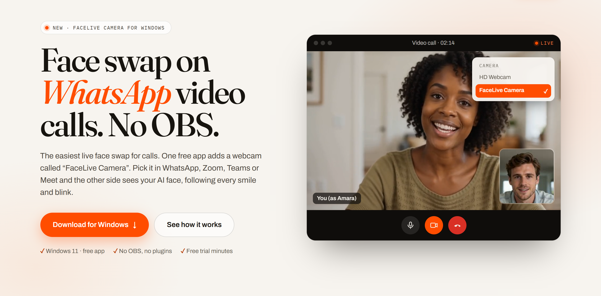

# FaceLive Camera

### The easiest live face swap for WhatsApp, Zoom, Teams and Google Meet calls. No OBS.

**[⬇ Download for Windows](https://facelive.online/download/windows?ref=github)** &nbsp;·&nbsp; [Tutorial](https://facelive.online/desktop) &nbsp;·&nbsp; [Try it in your browser](https://facelive.online/studio)

FaceLive Camera adds a webcam called **“FaceLive Camera”** to Windows. Pick it in any video call app and the other side sees your AI face live. It follows every smile, blink and head turn.

- **No OBS, no plugins, no virtual-camera setup.** Install once and pick it like any webcam.
- **Works everywhere you can choose a camera:** WhatsApp (app and web), Zoom, Microsoft Teams, Google Meet, Telegram, Discord, Skype, Slack, OBS.
- **No GPU needed.** The AI runs in the FaceLive cloud, so any laptop with a webcam works.
- **Call Mode** shrinks the app to a small window beside your call.

## Get started in 2 minutes

1. **[Download FaceLive Camera](https://facelive.online/download/windows?ref=github)** and unzip it.
2. Run `FaceLiveCamera.exe` and allow the one-time setup that adds the webcam.
   If Windows shows *“Windows protected your PC”*, click **More info → Run anyway**.
3. Sign in, press **Start camera**, pick a face and press **Transform**.
4. In your call app, open the camera settings and choose **FaceLive Camera**.

| App | Where to pick the camera |
| --- | --- |
| WhatsApp for Windows | Settings → Video & voice → Camera |
| WhatsApp Web (Chrome/Edge) | Site icon left of the address bar → Site settings → Camera |
| Zoom | Settings → Video → Camera |
| Microsoft Teams | Settings → Devices → Camera |
| Google Meet | Camera dropdown on the join screen, or ⋮ → Settings → Video |

Full tutorial with troubleshooting: **https://facelive.online/desktop**

## FAQ

**“Camera in use” in my call app?** You picked your real webcam. FaceLive uses it to read your face, so choose *FaceLive Camera* instead.

**Is it free?** The app is free. Live AI time uses FaceLive minutes, with free trial minutes to start. See [pricing](https://facelive.online/pricing).

**Requirements?** Windows 11 (64-bit), a webcam and an internet connection.

**Updates?** The app tells you when a new version is out, and the download link always serves the newest release. Most improvements arrive automatically because the Studio inside the app is live.

## Use it responsibly

Only use your own face or a likeness you have permission to use. Don't impersonate or deceive people. You must be 18+. See the [Terms](https://facelive.online/legal?p=terms).

---

© FaceLive · [facelive.online](https://facelive.online) · Support: info@facelive.online · Third-party licenses: [THIRD-PARTY-NOTICES.txt](THIRD-PARTY-NOTICES.txt)
